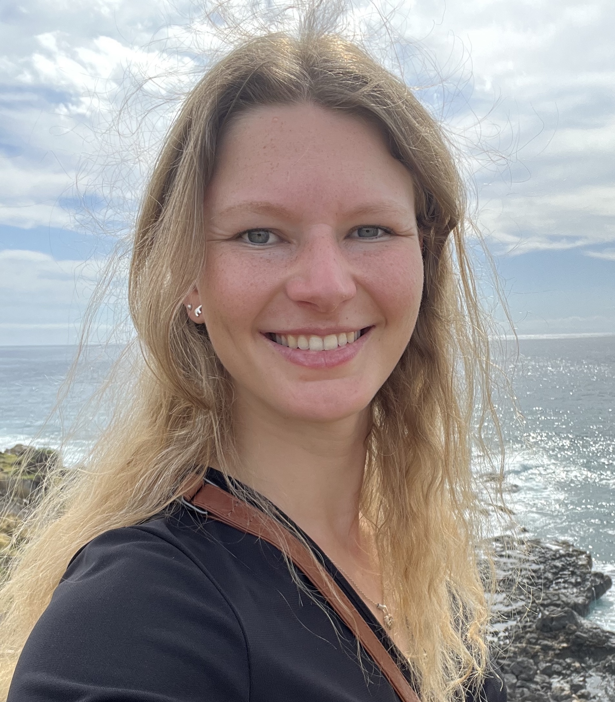

:::::::: columns
::::: {.column .left-column width="35%"}
:::: centered-profile
{.round-img}

### Ane Liv Berthelsen

#### PhD

::: social-icons
<a href="https://orcid.org/0000-0001-6718-6709" target="_blank" aria-label="ORCID"> <i class="fab fa-orcid"></i> </a> <a href="https://www.linkedin.com/in/ane-liv-berthelsen-3054431b3" target="_blank" aria-label="LinkedIn"> <i class="fab fa-linkedin"></i> </a> <a href="https://bsky.app/profile/anelivb.bsky.social" target="_blank" aria-label="Bluesky" class="social-link"> <svg class="social-svg" xmlns="http://www.w3.org/2000/svg" viewBox="0 0 24 24"> <path fill="currentColor" d="M12 10.8c-1.087 -2.114 -4.046 -6.053 -6.798 -7.995C2.566 0.944 1.561 1.266 0.902 1.565 0.139 1.908 0 3.08 0 3.768c0 0.69 0.378 5.65 0.624 6.479 0.815 2.736 3.713 3.66 6.383 3.364 0.136 -0.02 0.275 -0.039 0.415 -0.056 -0.138 0.022 -0.276 0.04 -0.415 0.056 -3.912 0.58 -7.387 2.005 -2.83 7.078 5.013 5.19 6.87 -1.113 7.823 -4.308 0.953 3.195 2.05 9.271 7.733 4.308 4.267 -4.308 1.172 -6.498 -2.74 -7.078a8.741 8.741 0 0 1 -0.415 -0.056c0.14 0.017 0.279 0.036 0.415 0.056 2.67 0.297 5.568 -0.628 6.383 -3.364 0.246 -0.828 0.624 -5.79 0.624 -6.478 0 -0.69 -0.139 -1.861 -0.902 -2.206 -0.659 -0.298 -1.664 -0.62 -4.3 1.24C16.046 4.748 13.087 8.687 12 10.8Z"/> </svg> </a> <a href="https://www.researchgate.net/profile/Ane-Liv-Berthelsen-2" target="_blank" aria-label="ResearchGate"> <i class="fab fa-researchgate"></i> </a> <a href="https://scholar.google.com/citations?user=bdCdKQEAAAAJ&hl=da" target="_blank" aria-label="Google Scholar"> <i class="fas fa-graduation-cap"></i> </a> <a href="https://github.com/AneLivB" target="_blank" aria-label="GitHub"> <i class="fab fa-github"></i> </a>

Bielefeld, Germany

<a href="assets/pdf/FullacademicCV.pdf" target="_blank" class="btn" role="button" style="background-color: #ffffff; color: #333333; border: 1px solid #cccccc; font-size: 0.85rem; padding: 6px 14px;"> <i class="fa-solid fa-file-pdf"></i> Download complete academic CV </a>

:::
::::
:::::

::: {.column width="5%"}
<!-- empty column to create gap -->
:::

::: {.column width="60%"}
## About me

Hi, I’m **Ane Liv Berthelsen** \[she/her\], a marine biologist working in the fields of molecular and behavioral ecology. Here you’ll find my current research, publications and illustrations.

------------------------------------------------------------------------

I hold a PhD in molecular and computational biology from the Evolutionary Population Genetics group, [the Hoffman lab](https://thehoffmanlab.com), at Bielefeld University, Germany. My research explored density from the concept of how individuals perceive it to its effects on fitness traits, transcriptomic profiles, predation risk and a broad range of phenotypic traits of Antarctic fur seals (*Arctocephalus gazella*). Thus, I employed a broad range of computational frameworks from bioinformatic pipelines to Bayesian hierarchical modelling.

I am currently wrapping up projects from my PhD investigating the drivers behind phenotypic trait variation in Antarctic fur seals and exploring a pausible link between plasticity and fitness.

I am open for opportunities in **Copenhagen from January 2027**.
:::
::::::::

## Education

:::::: timeline-item
::: timeline-year
2022-2026
:::

:::: timeline-content
**PhD in molecular ecology** \| <em>Bielefeld University</em>

::: timeline-desc
Defended 12.06.2026 (<strong>Magna cum laude</strong>)

**PhD Thesis**: "Effects of density on Antarctic fur seals"
:::
::::
::::::

:::::: timeline-item
::: timeline-year
2020-2021
:::

:::: timeline-content
**Visiting early career researcher** \| <em>Bielefeld University</em>

::: timeline-desc
Performed DNA extractions & PCR • Developed PhD project with Prof. Dr. Joseph I. Hoffman
:::
::::
::::::

:::::: timeline-item
::: timeline-year
2018-2020
:::

:::: timeline-content
**MSc in biodiversity, ecology and evolution** - <a href="https://www.imabee.eu/about-imabee">IMABEE</a> double degree \| <em>Aarhus University & Göttingen University</em>

::: timeline-desc
**MSc Thesis**: "The effect of anthropogenic disturbances on local wildlife: a comparative study of German wildcat populations"

Exchange semester: "Biodiversity and Ecosystem Management” \| *Camerino University*
:::
::::
::::::

:::::: timeline-item
::: timeline-year
2015-2018
:::

:::: timeline-content
**BSc in Biology** \| <em>Aarhus University</em>

::: timeline-desc
**BSc Thesis**: "Plasticity of temperature resistance in *Stegodyphus dumicola*"
:::
::::
::::::

## Non-academic employment

:::::: timeline-item
::: timeline-year
2026
:::

:::: timeline-content
**Science Educator** \| Seasonal employment, <em>Svanegrund National Park</em>

::: timeline-desc
Guide on RIB in Denmarks largest nature park • Seafarers Certification
:::
::::
::::::

:::::: timeline-item
::: timeline-year
2022-2024
:::

:::: timeline-content
**Ecology writer** \| Freelance employment, <em>The Pond Informer</em>

::: timeline-desc
Pub-science • North American fresh & saltwater fish species descriptions
:::
::::
::::::

:::::: timeline-item
::: timeline-year
2021
:::

:::: timeline-content
**Science Educator** \| Seasonal employment, <em>The Limfjord Museum</em>

::: timeline-desc
Speaker & public dissections • Snorkel instructor • Sailing small RIB
:::
::::
::::::

:::::: timeline-item
::: timeline-year
2016-2021
:::

:::: timeline-content
**Science Educator** \| Student employment, <em>The Kattegatcentret</em>

::: timeline-desc
Speaker & public dissections • Animal caretaking & training • Pioneered summer camp concept
:::
::::
::::::

:::::: timeline-item
::: timeline-year
2015-2016
:::

:::: timeline-content
**Math tutor** \| Student employment, <em>MentorDanmark</em>

::: timeline-desc
Private teacher • Age 7 to 17 • Children with special needs
:::
::::
::::::

:::::: timeline-item
::: timeline-year
2013-2015
:::

:::: timeline-content
**Amusement park employee** \| Seasonal employment, <em>Djurs Sommerland A/S</em>

::: timeline-desc
Customer service • Food production • Fire response training
:::
::::
::::::

:::::: timeline-item
::: timeline-year
2011-2019
:::

:::: timeline-content
**Track and field coach** \| Student employment, *Randers Freja Atletik og Motion*

::: timeline-desc
Coaching age 6 to 12 • Planning training programs • Sports Coach Certification
:::
::::
::::::

## Fieldwork

:::::: timeline-item
::: timeline-year
2026
:::

:::: timeline-content
**Surveying and tagging Galapagos Sea Lions** \| Caamaño, Galapagos, *Ecuador*

::: timeline-desc
Conducted daily 'resight' rounds, performed behavioural tests and observed natural behavioural of Galapagos sea lions. Deployed TDRs on adult females to explore feeding behaviour. Captured pups and yearlings from which biometric and hair samples were collected.
:::
::::
::::::

:::::: timeline-item
::: timeline-year
2023
:::

:::: timeline-content
**Bird Ringing Camp** \| Durankulak, *Bulgaria*

::: timeline-desc
Participated in mist-netting, morphological data collection, and bird ringing.
:::
::::
::::::

:::::: timeline-item
::: timeline-year
2023
:::

:::: timeline-content
**Surveying and tagging Galapagos Sea Lions** \| Caamaño, Galapagos, *Ecuador*

::: timeline-desc
Conducted daily 'resight' rounds, performed behavioural tests and observed natural behavioural of Galapagos sea lions. Captured pups and yearlings from which biometric and hair samples were collected.
:::
::::
::::::

:::::: timeline-item
::: timeline-year
2020
:::

:::: timeline-content
**Camera trapping European Wildcat** \| Hessen, *Germany*

::: timeline-desc
Set up and managed trail cameras to monitor the local European wildcat population.
:::
::::
::::::

## Invited talks

:::::: timeline-item
::: timeline-year
2026
:::

:::: timeline-content
**Teaching YOLO to count seals: from images to ecological data**

::: timeline-desc
26th Biennial Conference on the Biology of Marine Mammals \| *San Juan, Puerto Rico*
:::
::::
::::::

:::::: timeline-item
::: timeline-year
2024
:::

:::: timeline-content
**A plastic carol: laboratory sustainability and the reusability of microtiter plates**

::: timeline-desc
Research and Technology Centre (FTZ), Coastal Ecology \| *Büsum, Germany*
:::
::::
::::::

## Presentations & Seminars

*Note: Conference names in bold*

:::::: timeline-item
::: timeline-year
2026
:::

:::: timeline-content
**Colony matters: density shapes predator access in Antarctic fur seal (*Arctocephalus gazella*) breeding colonies**

::: timeline-desc
**ICYMARE**, *Bremen University, Germany*
:::
::::
::::::

:::::: timeline-item
::: timeline-year
2025
:::

:::: timeline-content
**What drives variation in phenotypic traits? A variance decomposition study**

::: timeline-desc
NC3 Retreat, *Bielefeld University, Germany*
:::
::::
::::::

:::::: timeline-item
::: timeline-year
2025
:::

:::: timeline-content
**Mum Power: Insights into the role of female Antarctic fur seals in mitigating predation risk**

::: timeline-desc
**European Cetacean Society Conference (ECS)**, *Ponta Delgada, Azores*
:::
::::
::::::

:::::: timeline-item
::: timeline-year
2024
:::

:::: timeline-content
**Sustainability in the lab: reusability of 96 well plates for microsatellite genotyping**

::: timeline-desc
**ICYMARE**, *Bremen University, Germany*
:::
::::
::::::

:::::: timeline-item
::: timeline-year
2024
:::

:::: timeline-content
**Remote observation of an Antarctic fur seal (*Arctocephalus gazella*) colony**

::: timeline-desc
**NC3 Conference**, *Münster University, Germany*
:::
::::
::::::

:::::: timeline-item
::: timeline-year
2024
:::

:::: timeline-content
**Sustainability in the lab: reusability of 96 well plates for microsatellites**

::: timeline-desc
Animal Behavior Seminar, *Bielefeld University, Germany*
:::
::::
::::::

:::::: timeline-item
::: timeline-year
2023
:::

:::: timeline-content
**Decomposition of trait variability in a decreasing marine mammal population**

::: timeline-desc
**ICYMARE**, *Oldenburg University, Germany*
:::
::::
::::::

:::::: timeline-item
::: timeline-year
2022
:::

:::: timeline-content
**Project idea: Trait decomposition in Antarctic fur seals**

::: timeline-desc
Animal Behavior Seminar, *Bielefeld University, Germany*
:::
::::
::::::

:::::: timeline-item
::: timeline-year
2022
:::

:::: timeline-content
**Density assessment and the effect of anthropogenic disturbance on German wildcats**

::: timeline-desc
Animal Behavior Seminar, *Bielefeld University, Germany*
:::
::::
::::::

## Workshops

*Note: Invited calls in bold*

:::::: timeline-item
::: timeline-year
2026
:::

:::: timeline-content
**From Image to Analysis: A practical workshop on automated wildlife detections**

::: timeline-desc
ICYMARE, *Bremen University, Germany*
:::
::::
::::::

:::::: timeline-item
::: timeline-year
2026
:::

:::: timeline-content
**Equity, Diversity and Inclusivity in practice: addressing everyday issues in academia**

::: timeline-desc
**Science: To be determined**, German Centre for Integrative Biodiversity Research (iDiv), *Leipzig, Germany*
:::
::::
::::::

## Poster Presentations

:::::: timeline-item
::: timeline-year
2026
:::

:::: timeline-content
**From morphology to microbiomes: trait-dependent variance decomposition in a wild marine mammal**

::: timeline-desc
26th Biennial Conference on the Biology of Marine Mammals, *San Juan, Puerto Rico*
:::
::::
::::::

:::::: timeline-item
::: timeline-year
2024
:::

:::: timeline-content
**What drives variation? Variance decomposition of phenotypic traits in Antarctic fur seals**

::: timeline-desc
25th Biennial Conference on the Biology of Marine Mammals, *Perth, Western Australia*
:::
::::
::::::

:::::: timeline-item
::: timeline-year
2024
:::

:::: timeline-content
**Nature, nurture or somewhere in between? What shapes phenotypic traits of Antarctic fur seal pups**

::: timeline-desc
Conservation Genomics Paris, Muséum National d’Histoire Naturelle, *Paris, France*
:::
::::
::::::

:::::: timeline-item
::: timeline-year
2023
:::

:::: timeline-content
**Growth curves of Antarctic fur seal pups from birth to weaning**

::: timeline-desc
Behaviour 2023, *Bielefeld University, Germany*
:::
::::
::::::

:::::: timeline-item
::: timeline-year
2019
:::

:::: timeline-content
**How different combinations of stress and disturbance affect the facilitation process**

::: timeline-desc
38th Meeting Eastern Alpine and Dinaric Society for Vegetation Ecology, *Colfiorito di Foligno, Italy*
:::
::::
::::::

## Research visits

:::::: timeline-item
::: timeline-year
2024, 2026
:::

:::: timeline-content
**The Fabry Lab**, Friedrich-Alexander-Universität Erlangen-Nürnberg, *Erlangen, Germany*

::: timeline-desc
Collaborative research visits focusing on automated image analysis (YOLO).
:::
::::
::::::

:::::: timeline-item
::: timeline-year
2021
:::

:::: timeline-content
**Department for Wildlife Disease**, Leibniz Institute for Zoo and Wildlife Research (IZW), *Berlin, Germany*

::: timeline-desc
Learning how to identify white blood cells and parasites in haematological smears
:::
::::
::::::

## Teaching experience

:::::: timeline-item
::: timeline-year
2024-2025
:::

:::: timeline-content
**Marine Conservation** \| Bachelor course, *Bielefeld University*

::: timeline-desc
Prepared and gave lectures on the topic 'Marine Conservation' in the general course 'Conservation Biology'.
:::
::::
::::::

:::::: timeline-item
::: timeline-year
2016-2021
:::

:::: timeline-content
**Basic Biology** \| 'Zzzov med hajerne', *The Kattegatcentret*

::: timeline-desc
Prepared and gave weekly talks about shark ecology and evolution, harbour seal ecology and behaviour, biodiversity in the Danish oceans and squid morphology and behaviour (coupled with a public dissection).
:::
::::
::::::

## Student supervision

:::::: timeline-item
::: timeline-year
2023
:::

:::: timeline-content
**Laboratory intern** \| *Bielefeld University*

::: timeline-desc
Trained and instructed a laboratory intern in high-throughput DNA extractions, gel electrophoresis, and PCR protocols.
:::
::::
::::::

## Other academic activities

Conference co-organiser and Scientific committee member:

::::: timeline-item
::: timeline-year
2023
:::

::: timeline-content
**Behaviour 2023** \| 14th to 20th August, *Bielefeld University*
:::
:::::

Symposium co-organiser:

::::: timeline-item
::: timeline-year
2023
:::

::: timeline-content
**Causes and consequences of individualization in behavioural ecology** \| 14th to 20th August, *Behaviour 2023*
:::
:::::

Seminar co-organiser:

::::: timeline-item
::: timeline-year
2023-2024
:::

::: timeline-content
**Animal behaviour seminar** \| *Bielefeld University*
:::
:::::

Society membership:

::::: timeline-item
::: timeline-year
2024-2026
:::

::: timeline-content
**Society for Marine Mammalogy**
:::
:::::

::::: timeline-item
::: timeline-year
2023-2026
:::

::: timeline-content
**Society for open, reliable, and transparent ecology and evolutionary biology**
:::
:::::

## Grants, Stipends and Prizes

*Total funding secured: **€ 22,982***

::::: timeline-item
::: timeline-year
2026
:::

::: timeline-content
**Equal Opportunities Commissions Stipend** (€ 4,950) \| *Bielefeld University*

**Equal Opportunities Commissions Travel Grant** (€ 400)
:::
:::::

::::: timeline-item
::: timeline-year
2024
:::

::: timeline-content
**The Viet-Jacobsen Fund** (€ 1,340)

**The Friedrich W. Franks Fund** (€ 1,340)
:::
:::::

::::: timeline-item
::: timeline-year
2023
:::

::: timeline-content
**The William Demant Fund** (€ 1,400)

**The Viet-Jacobsen Fund** (€ 1,340)

**The Augustinus Fund** (€ 533)
:::
:::::

::::: timeline-item
::: timeline-year
2022
:::

::: timeline-content
**Career Bridge Master-Doctorate Stipend** (€ 6,000) \| *Bielefeld University*
:::
:::::

::::: timeline-item
::: timeline-year
2019
:::

::: timeline-content
**ERASMUS Exchange Stipends** (€ 3,360 + € 979)
:::
:::::

::::: timeline-item
::: timeline-year
2018
:::

::: timeline-content
**Youth Trophy** (€ 670)
:::
:::::

::::: timeline-item
::: timeline-year
2011
:::

::: timeline-content
**Head of class '11: Science Prize** (€ 670)
:::
:::::

## Skills, Certifications & Languages

::::: grid
::: {.g-col-12 .g-col-md-6}
### Computational skills

-   **Statistics & modeling:**
    -   R (Bayesian hierarchical modeling, `brms`)
    -   Transcriptomics (DGE using `limma`/`voom`)
    -   Automated computer vision workflows (YOLO)
-   **Workflows & clusters:**
    -   Git/GitHub
    -   Reproducible research (Quarto/RMarkdown)
    -   Bash HPC environments
:::

::: {.g-col-12 .g-col-md-6}
### Certifications & Languages

-   **Certifications:**
    -   Seafarers Certificate (Fit for work at sea, until 2028)
    -   PADI Advanced Open Water Divers certificate
    -   Driver's License (B & A2)
-   **Languages:**
    -   **Danish & English:** Native / Fluent
    -   **German:** Intermediate
    -   **Spanish & Italian:** Beginner
:::
:::::
