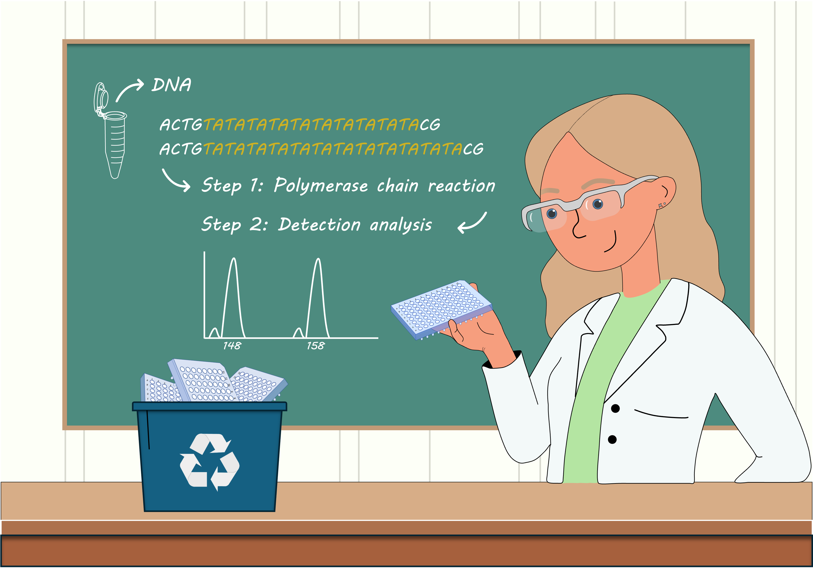
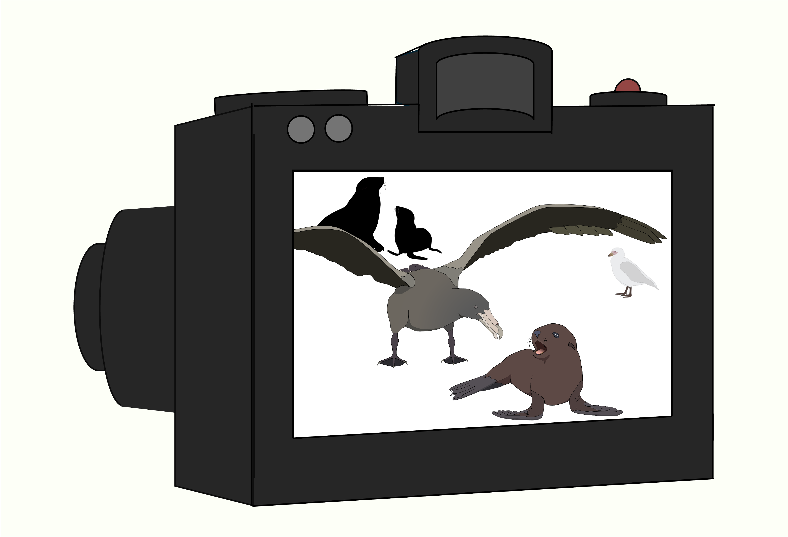
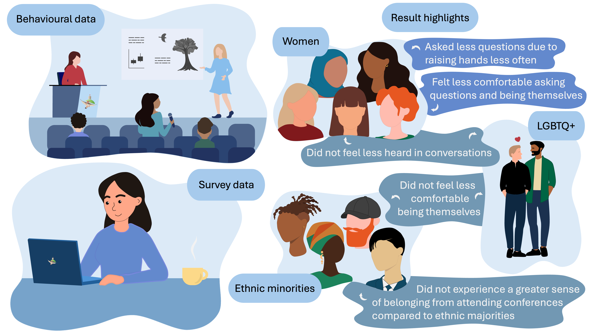
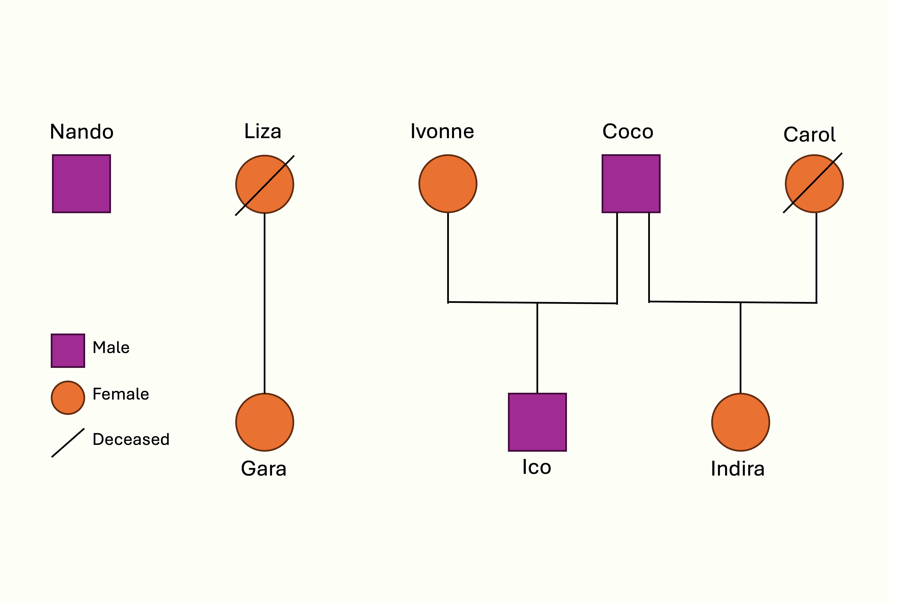

```{=html}
<script>
document.addEventListener("DOMContentLoaded", () => {
  document.querySelectorAll(".callout-tip[data-link]").forEach(card => {
    card.addEventListener("click", () => {
      window.location = card.getAttribute("data-link");
    });
  });
});
</script>
```

## Projects

::::::: grid
:::: g-col-6
::: {.callout-tip appearance="simple" icon="false" data-link="https://ecoevorxiv.org/repository/view/8704/"}
### Percieved density project

Exploring how individual differences in perceived population density shape behavior, ecological niches, and evolutionary outcomes.

[Preprint]{.tag .preprint} [PhD chapter]{.tag .phd-chapter}
:::
::::

:::: g-col-6
::: {.callout-tip appearance="simple" icon="false" data-link="https://royalsocietypublishing.org/doi/10.1098/rsos.242226"}


### Sustainable Genetics Project

Evaluating sustainable reuse of single-use microtitre plates in labs to reduce plastic waste without compromising genotyping accuracy.

[Published]{.tag .completed} [PhD chapter]{.tag .phd-chapter} [Code]{.tag .code}
:::
::::
:::::::

::::::: grid
:::: g-col-6
::: {.callout-tip appearance="simple" icon="false" data-link="https://www.nature.com/articles/s41598-024-62290-x"}
### Pup Growth Project

Investigating how inbreeding affects pup survival in Antarctic fur seals amid environmental change and food scarcity.

[Published]{.tag .completed} [PhD chapter]{.tag .phd-chapter} [Code]{.tag .code}
:::
::::

:::: g-col-6
::: {.callout-tip appearance="simple" icon="false" data-link="https://ecoevorxiv.org/repository/view/8704/"}


### Bird Island Imagery Project

Investigating how fine-scale density patterns shape predator-prey interactions using a remote camera and automated detection.

[Ongoing]{.tag .current} [PhD chapter]{.tag .phd-chapter}
:::
::::
:::::::

::::::: grid
:::: g-col-6
::: {.callout-tip appearance="simple" icon="false" data-link="https://onlinelibrary.wiley.com/doi/10.1002/ece3.71588"}


### EDI study

Examining gender disparities in question-asking at a scientific conference to understand barriers to inclusion and equity in academic settings.

[Published]{.tag .completed} [Code]{.tag .code}
:::
::::

:::: g-col-6
::: {.callout-tip appearance="simple" icon="false" data-link="https://ecoevorxiv.org/repository/view/8704/"}
### Gene Expression Project

Using differential gene expression profiles to reveal the immune-challenging environment faced by Antarctic fur seals.

[Ongoing]{.tag .current} [PhD chapter]{.tag .phd-chapter}
:::
::::
:::::::

::::::: grid
:::: g-col-6
::: {.callout-tip appearance="simple" icon="false" data-link="https://onlinelibrary.wiley.com/doi/10.1002/ece3.71588"}
### Trait decomposition Project

Decomposing phenotypic traits to understand the genetic and environmental contributions in Antarctic fur seal pups.

[Ongoing]{.tag .current} [PhD chapter]{.tag .phd-chapter}
:::
::::

:::: g-col-6
::: {.callout-tip appearance="simple" icon="false" data-link="https://ecoevorxiv.org/repository/view/8704/"}
### Bird Island Imagery Project II

Validating a retrained detection algorithm as a proof of concept for studying colonial species using remote camera monitoring.

[Ongoing]{.tag .current} [PhD chapter]{.tag .phd-chapter}
:::
::::
:::::::

::::::: grid
:::: g-col-6
::: {.callout-tip appearance="simple" icon="false" data-link="https://ecoevorxiv.org/repository/view/8694/"}
### Epigenetics & NC3 Project

Exploring how epigenetic mechanisms shape individualized niches and contribute to eco-evolutionary diversity.

[Preprint]{.tag .preprint}
:::
::::

:::: g-col-6
::: {.callout-tip appearance="simple" icon="false" data-link="https://ecoevorxiv.org/repository/view/8704/"}


### South American Sea Lion Project

Using microsatellites to determine paternity and reconstruct pedigrees in captive South American sea lions.

[Completed]{.tag .completed} [Side quest]{.tag .side-quest}
:::
::::
:::::::
