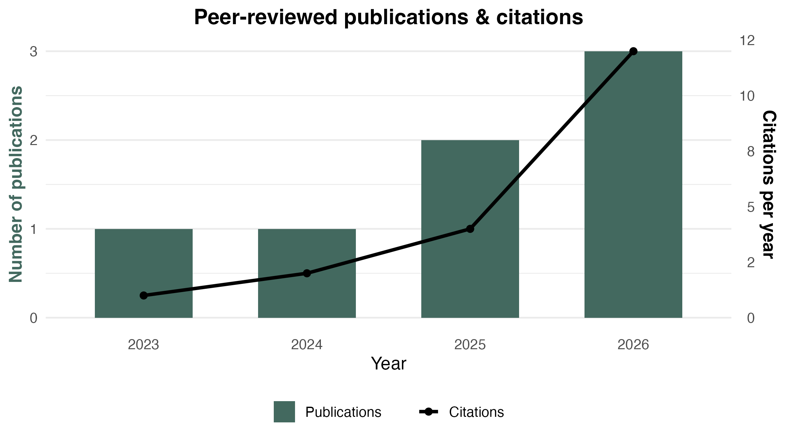

---
format:
  html:
    theme:  styles.css
    page-layout: full
    toc: true
    css: custom.css
    include-in-header: fontawesome.html
    lightbox: true
---

::: {.grid}

::: {.g-col-12 .g-col-md-6}
# Publication record
Here you will find my complete history of academic work. Preprints, manuscripts that are currently in review, and publications published in peer-reviewed journals. 
:::

::: {.g-col-12 .g-col-md-6}
{.lightbox width="100%"}
:::

:::

---

## In-review & preprints

- I. Reeves, G. Genty, ..., **A.L. Berthelsen**, et al. “Advancing marine mammal conservation through omics tools and integration of Indigenous Ecological Knowledge” (Under review for *Molecular Ecology*)
- **A.L. Berthelsen**, C. Stainfield, C. Toscani, et al. “Immune signals dominate transcriptomic responses to developmental and life-history transitions in Antarctic fur seals” (Under review for *Molecular Ecology*)

<!-- Automatically populated via Google Scholar by Pup_data.R -->


## Peer-reviewed publications



## Theses



**A.L. Berthelsen** (2020) “The effect of anthropogenic disturbances on local wildlife: a comparative study of German wildcat populations”. *Master's Thesis*, *Aarhus & Göttingen Univeristy*. [<i class="fa-solid fa-file-pdf"></i> PDF](assets/pdf/Plasticity_of_temperature_resistance_in_Stegodyphus_dumicola.pdf){target="_blank"}

**A.L. Berthelsen** (2018) “Plasticity of temperature resistance in *Stegodyphus dumicola*”. *Bachelor's Thesis*, *Aarhus Univeristy*. [<i class="fa-solid fa-file-pdf"></i> PDF](assets/pdf/Plasticity_of_temperature_resistance_in_Stegodyphus_dumicola.pdf){target="_blank"}
